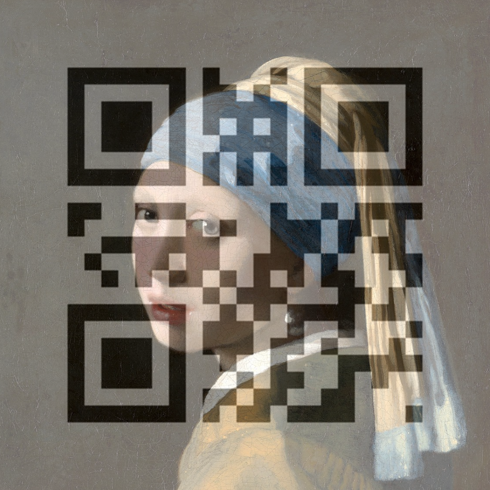

# QRdiffusion

## Roadmap

My guess is that they trained a ControlNet conditioned on QR codes to achieve this.

Therefore I'll need to:

- Create a function that receives an image and a url, generates the QR for said url, and then overlays the QR into the image. Lets define it as $QR(i, u)$.
- Create a dataloader based on a subset of Laion-Aesthetic.
    - For each image $i$, generate a QR code based on a random url $u$ and create $i_{qr} = QR(i, u)$.
    - Return the prompt $t$ associated to $i$, the QR $qr$ and $i_{qr}$.
- Train a ControlNet following this (kinda) logic:

```
cn = ControlNet
for (prompt, qr, img_qr) in dataloader:
    y = cn(prompt, qr)
    loss = sim(img_qr, y)
```

## Advances

### QRify

Done. Here's an example of the interface to overlay a QR.

```python
from utils import overlay_qr

overlay_qr(url="google.com", image="base_img.jpg", alpha=0.4)
```



I'm not sure which alpha should I use to create the final dataset though.

### Dataset

todo

### Training

todo
